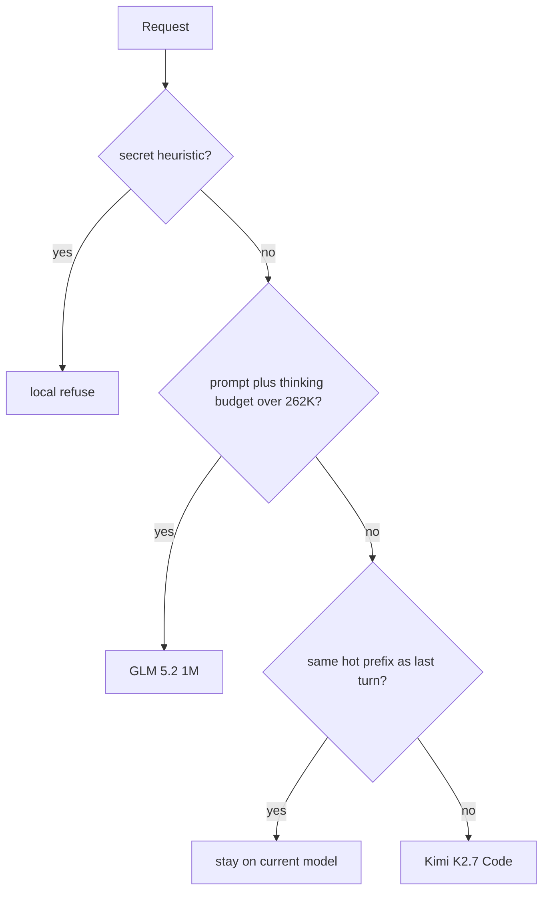

# Fireworks + vLLM Semantic Router (coding-agent demo)

Local [vLLM Semantic Router](https://github.com/vllm-project/semantic-router) (`vllm-sr` 0.3) in front of current Fireworks serverless coding models.

This README is the demo. There is no credits-ask and no savings percentage.

## Policy



| If | Then | Why |
|---|---|---|
| Secret-shaped prompt | Local refuse | Never send the body to Fireworks |
| Prompt + reserved thinking/output ≳ 262K | GLM 5.2 | Kimi window is 262K; GLM is 1M |
| Same hot prefix as last turn | Stay | Cached input is $0.19 vs $0.95 on Kimi |
| Anything else | Kimi K2.7 Code | Coding-agent default |

Complexity cost bands (`trivial_edit` / `moderate_change` / `complex_reasoning`) are deleted. The seeded histogram (`fixtures/traces/`, **synthetic-shape**, not a Claude Code dump) is tool and multi-turn agent traffic. MiniMax is in the catalog for smoke and counterfactual pricing only. Re-add it as a route only if live traces show real no-tool, short, non-critical turns **and** a quality check does not fail.

Fireworks already ships Standard / Priority / Fast serving paths (for example `accounts/fireworks/routers/glm-5p2-fast`). This demo does not reimplement them. Do not pretend Fast is a cheaper mid-tier.

## Prices (official Standard, 2026-09-03)

From [Fireworks serverless pricing](https://docs.fireworks.ai/serverless/pricing). Cells are **input / cached input / output** per 1M tokens.

| Role | Model | Input / cached / output | Context |
|---|---|---|---|
| catalog / smoke | `accounts/fireworks/models/minimax-m3` | $0.30 / $0.06 / $1.20 | 512K |
| default / stay | `accounts/fireworks/models/kimi-k2p7-code` | $0.95 / $0.19 / $4.00 | 262K |
| over Kimi budget | `accounts/fireworks/models/glm-5p2` | $1.40 / $0.14 / $4.40 | 1M |

K2.7 Code thinking is on by default. Do not send `chat_template_kwargs.enable_thinking`.

MiniMax M2.5 and Kimi K2.6 Turbo are deprecated on serverless. Do not put them back.

## What the sidecar is allowed to decide

`"model": "MoM"` enters the recipe (signals, plugins, cache-aware stay). A Fireworks model ID is pass-through: **no** `contain_secrets`, **no** `over_kimi_budget`, **no** `coding_default`, **no** prefix-stay algorithm.

```
client
  │
  ▼
listener  ← read `vllm-sr status` for the real bind
  │           (last box used 18080/inference/v1 for chat, 8080 for eval/replay)
  ▼
recipe    ← only if model is MoM
  │
  ▼
https://api.fireworks.ai/inference/v1
```

`scripts/bypass_check.py` asserts that contract: the same secret-shaped prompt matches `contain_secrets` through eval/`MoM`, and a pinned `accounts/fireworks/models/kimi-k2p7-code` chat does not run the refuse plugin. The pin path never sends the secret body to Fireworks.

### Preserved thinking

K2.7 thinking is on by default. The next turn's `messages` must keep `reasoning_content` (or the provider's equivalent) from the previous assistant message. Dropping it breaks both quality and prefix cache. See [Fireworks reasoning](https://docs.fireworks.ai/guides/reasoning).

## What the numbers are allowed to say

| Source | What it proves |
|---|---|
| `python3 scripts/eval_suite.py` | Which decision/model a held-out request would hit. Free. Not dollars. Misses are the result — exit 3 is publishable. |
| `python3 scripts/trace_histogram.py` | Shape of captured turns (prompt tokens, cached fraction, tools, budget vs 262K / 512K / 1M). Seed traces are **synthetic-shape**. |
| Live chat `usage` | Tokens actually billed, including cached input when the API reports it. |
| `python3 scripts/price_traces.py` | Same traces priced as always-Kimi / always-GLM / always-MiniMax / routed. Rows with `completion_tokens >= max_tokens` are flagged incomplete. Not a "% cheaper." |
| `scripts/cost_chart.py` | Token-hold counterfactual on a dump. [`fixtures/replay-sample.json`](fixtures/replay-sample.json) invents cache hits — smoke only. |

Do not publish a four-shot "% cheaper."

## Setup

```bash
export FIREWORKS_API_KEY=...          # never commit this
vllm-sr validate --config config.yaml
vllm-sr serve --config config.yaml    # needs Docker
vllm-sr status                        # chat + management ports
```

Scripts default to chat `http://127.0.0.1:18080/inference/v1/chat/completions` and eval/replay on `8080` via `ROUTER_CHAT_URL`, `ROUTER_EVAL_URL`, and `ROUTER_REPLAY_URL`. Those were last-box values, not lore. Prefer `vllm-sr status`.

```bash
# Routing-only suite (free). Held-out prompts. Exits 3 on mis-routes.
python3 scripts/eval_suite.py

# MoM vs pin contract (eval + one harmless pinned chat).
python3 scripts/bypass_check.py

# One routed completion (not a pinned model).
./scripts/e2e_probe.sh

# Four live calls. Smoke only. Capped completions are incomplete.
python3 scripts/founder_four.py

# Histogram + price the seeded traces (no Fireworks call).
python3 scripts/trace_histogram.py
python3 scripts/price_traces.py
```

## Traces

[`fixtures/traces/schema.json`](fixtures/traces/schema.json) is one turn: `messages`, `tools`, `usage` (prompt / cached / completion / thinking if present), `model`, optional `quality`.

```bash
python3 scripts/ingest_trace.py path/to/request.json
python3 scripts/ingest_trace.py path/to/dumps/   # directory
```

Point Claude Code at `MoM` and drop 20–50 redacted turns into `fixtures/traces/` when you can. Until then the histogram is labeled **synthetic-shape** and must not be quoted as live Claude Code usage.

Context cutover is a **budget** (prompt + tools + thinking + max output) against 262K / 512K / 1M, not `"pad " * 210000`. The `over_kimi_budget` signal approximates that with a 230K request-token band (32K reserved for thinking + `max_tokens`).

## Test set

[`fixtures/prompts.json`](fixtures/prompts.json) is held-out. After the band collapse, coding one-liners and agent shapes expect `coding_default` → Kimi. Secrets expect `contain_secrets`. The long row pads enough request tokens to trip `over_kimi_budget` — it is a budget stand-in, not a repo dump.

[`fixtures/complexity-exemplars.json`](fixtures/complexity-exemplars.json) is unused. Kept so nobody pastes eval prompts back into a slogan classifier.

## Limitations

- **Heuristic containment.** Keyword + regex. Not a PII model.
- **No real Claude Code history** in this tree. Seed traces are synthetic shapes from the agent fixtures.
- **Eval is routing-only.** [`docs/eval-results.md`](docs/eval-results.md) is the signed miss table for this `config.yaml`. Trace-cost is still the synthetic-shape wiring table, not a bill.
- **No Fast / Priority experiment** unless traces show 503s or someone explicitly wants a latency column from a real Fast call.
