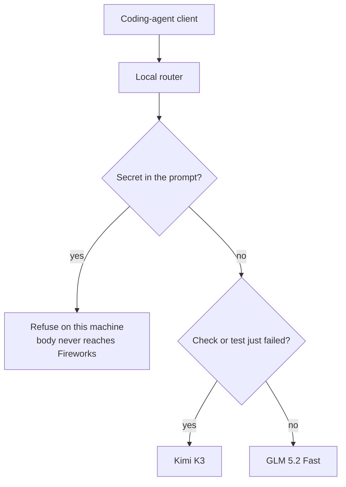
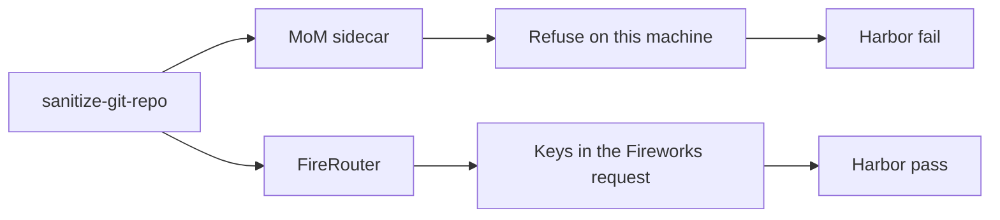
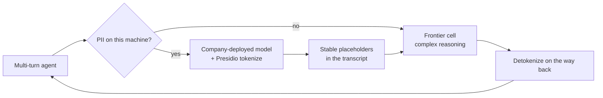

# Fireworks coding-agent router

A local sidecar in front of [Fireworks](https://fireworks.ai) serverless. The point of this repo is to compare **MoM** (this sidecar) with **FireRouter** (`firerouter/kimi-k3/glm-5p2-fast`) on the same Terminal-Bench 2.1 tasks: same pair, same official prices, pass rate and $ per pass.

A coding-agent client sends one request. The sidecar either refuses it on this machine or picks **GLM 5.2 Fast** or **Kimi K3**. K3 is when the latest check or test failed. After a write or ok check the next turn can hop back to GLM on the same `prompt_cache_key`. The hop does not need `x-routing-preference`. The `keep_current_model` emit is diagnostic — [vLLM SR #2009](https://github.com/vllm-project/semantic-router/issues/2009).

Built on [vLLM Semantic Router](https://github.com/vllm-project/semantic-router) 0.3. Models are current Fireworks Standard serverless (as of 2026-09-04). Not a savings pitch and not a new model vendor.

---

## The problem this is for

A coding agent typically talks to **one** model ID. That is simple, and it is expensive in the wrong places:

1. **Secrets leave the building.** An API key or private key pasted into chat goes straight to the provider.
2. **Hopping models busts cache.** Fireworks cached input on Kimi K3 is **$0.30 / 1M** versus **$3.00 / 1M** uncached.

Kimi K3 and GLM 5.2 Fast both have ~1M context. FireRouter already sells that pair. This sidecar sits in front of the same two cells and chooses from the shape of the request.

---

## What the router does



| Situation | Action | Why |
|---|---|---|
| Secret-shaped prompt (assigned key / PEM / token). Env-var *names* are allowed. | **Refuse locally** | The body never goes to Fireworks |
| Latest check or test failed | **Kimi K3** | Escalate from the transcript, no FireRouter preference header |
| Tools, writes, ok checks, multi-turn | **GLM 5.2 Fast** | Cheap cell; same `prompt_cache_key` can hit after a return from K3 |
| Cold single-turn, no tools | **GLM 5.2 Fast** | Same cheap cell |

This is **request shape**, not “easy / mid / hard.” **KV does not transfer.** A hop to K3 refills uncached K3 input. Returning to GLM on the same key can hit. A subagent is a **new** `prompt_cache_key` (plus `user` and `x-session-affinity`).

**`MoM` is a local recipe name, not a Fireworks model.** Clients send `"model": "MoM"` so the policy runs. Fireworks itself rejects `MoM`.

Pin through **this sidecar** with the local card name: `fireworks/kimi-k3` or `fireworks/glm-5p2-fast`. That is pass-through (no refuse, no stay). Sending the Fireworks account id to port 18080 is HTTP 400.

K3 thinking is always on. Optional top-level `reasoning_effort`: `low` / `high` / `max` (Fireworks / Kimi default is `max`). The next turn must keep `reasoning_content` on the previous assistant message. See [Fireworks reasoning](https://docs.fireworks.ai/guides/reasoning).

---

## Models and official prices

Standard list from [Fireworks serverless pricing](https://docs.fireworks.ai/serverless/pricing), **2026-09-04**. Cells are **input / cached input / output** per 1M tokens.

| Role | Model | Input / cached / output | Context |
|---|---|---|---|
| Tool-loop / fail-open | `accounts/fireworks/models/kimi-k3` | $3.00 / **$0.30** / $15.00 | ~1M |
| Cheap cell | `accounts/fireworks/routers/glm-5p2-fast` | $2.10 / $0.21 / $6.60 | ~1M |

The Fast request body returns `accounts/fireworks/models/glm-5p2`. This is the same pair as `firerouter/kimi-k3/glm-5p2-fast`.

---

## MoM vs FireRouter (Terminal-Bench 2.1)

The comparison is Harbor [Terminal-Bench 2.1](https://github.com/harbor-framework/terminal-bench-2-1) (89 tasks pinned in [`fixtures/tbench/manifest.json`](fixtures/tbench/manifest.json)). Same agent loop, same spend accounting.

| Arm | Where | Model | Preference header |
|---|---|---|---|
| `mom` | local sidecar `:18080` | `"MoM"` | none — escalate from a failed check |
| `fr-balanced` | `api.fireworks.ai` | `firerouter/kimi-k3/glm-5p2-fast` | none |
| `fr-pref1` | `api.fireworks.ai` | same slug | `x-routing-preference: 1` (optional baseline) |

Pass is Harbor's hidden grader. $ is recorded `usage` at official cells; cached tokens are not invented. Time is `elapsed_s` (model + tool loop). Rows below are **both-pass only** (`k=1`, `TASK_MAX_TURNS=8`, `MomHarborAgent`). This is **not** an official tbench.ai leaderboard number (`k=5`, stock Harbor agent, public upload). Sources and regenerate: [docs/mom-vs-fr.md](docs/mom-vs-fr.md) (`python3 scripts/tbench.py --tradeoff`).

| task | MoM $ / s | FR $ / s | who cheaper | who faster |
|---|---|---|---|---|
| `openssl-selfsigned-cert` | $0.0168 / 42.3s | $0.0311 / 34.2s | MoM | FireRouter |
| `fix-git` | $0.0243 / 33.7s | $0.0286 / 41.5s | MoM | MoM |
| `nginx-request-logging` | $0.0174 / 88.2s | $0.0173 / 75.4s | tie | FireRouter |
| `kv-store-grpc` | $0.0235 / 31.0s | $0.0205 / 47.0s | FireRouter | MoM |
| `git-leak-recovery` | $0.0173 / 27.9s | $0.0225 / 31.7s | MoM | MoM |
| `log-summary-date-ranges` | $0.0289 / 11.9s | $0.0134 / 29.2s | FireRouter | MoM |
| `polyglot-c-py` | $0.0611 / 63.0s | $0.0300 / 41.0s | FireRouter | FireRouter |
| `db-wal-recovery` | $0.0671 / 37.8s | $0.0243 / 31.2s | FireRouter | FireRouter |

Stay-on-GLM can be cheaper and slower (`openssl-selfsigned-cert`) or cheaper and faster (`fix-git`, `git-leak-recovery`). FireRouter opening on K3 can be cheaper — and sometimes faster — on hard both-pass work (`polyglot-c-py`, `db-wal-recovery`). When FireRouter is cheaper, MoM is often the faster loop (`log-summary-date-ranges`, `kv-store-grpc`). Cost/time tradeoff on paired passes, not a claim we beat FireRouter.

`sanitize-git-repo` is not a `$` row. MoM hit `contain_secrets` / `fast_response`: **$0, no backend call**, Harbor fail. FireRouter ran K3 × 8, **pass $0.109** — key-shaped repo text left the box. The first refuse matched the instruction *name* `AWS_SECRET_ACCESS_KEY`; after the assignment/token-shape fix MoM can *run* that instruction. We went head to head; we dropped the task whose job is to send secrets out.



Today the sidecar either refuses on this machine or the raw turn goes to Fireworks. The middle path is not built and is not in the `$` table: detect PII here, **tokenize** with a company-deployed model and [Microsoft Presidio](https://microsoft.github.io/presidio/), send a redacted transcript to a frontier cell, detokenize on the way back. Placeholders stay stable across turns so hops do not ship names, keys, or repo secrets.



---

## What we will not claim

- **No published “% cheaper.”** Pass rate and $ per pass on a Harbor subset are not a customer savings rate.
- **Containment is a heuristic** (keywords + regex), not a PII classifier.
- **No official Terminal-Bench leaderboard score.** A `k=1` Harbor subset with `MomHarborAgent` is not a tbench.ai row.
- **KV does not transfer.** Hopping to K3 refills uncached K3 input.

---

## How a client uses it

The sidecar cannot read `role: tool`, so this repo suffixes a failed check on the last user message (`scripts/harbor_mom_agent.py`).

1. Point the coding-agent client at the local router instead of `https://api.fireworks.ai/inference/v1`.
2. Set `"model": "MoM"` so the policy runs.
3. Give each subagent its own `prompt_cache_key`, `user`, and `x-session-affinity`.
4. Keep Fireworks’ API key on the router host only (`FIREWORKS_API_KEY`).
5. Read `vllm-sr status` for the bind. Chat is typically `http://127.0.0.1:18080/inference/v1/chat/completions`; management / eval stays on `8080`.

```bash
export FIREWORKS_API_KEY=...          # never commit this
vllm-sr validate --config config.yaml
./scripts/serve.sh up                 # named volumes; wait for startup_complete
./scripts/serve.sh status             # chat 18080, eval 8080
```

Stock `vllm-sr serve --config config.yaml --minimal` (with `VLLM_SR_STATE_ROOT_DIR` off `/tmp`) still dies on this Docker Desktop:

```
error mounting ".../envoy.yaml" to rootfs at "/etc/envoy/envoy.yaml":
not a directory: unknown: Are you trying to mount a directory onto a
file (or vice-versa)?
```

`scripts/serve.sh` injects `config.yaml` and a generated `envoy.yaml` into named volumes `vllm-sr-state` / `vllm-sr-models` (directory mounts only) and waits for `startup_complete`. After a config change: `./scripts/serve.sh reload`. Embed models must already be in `vllm-sr-models` (~4.6G).

```bash
python3 scripts/tbench.py --list               # $0: 89 pinned slugs
python3 scripts/tbench.py --selftest           # $0: pin + marker + parse + markdown
# uv tool install harbor   # or: pip install -r requirements-tbench.txt
TASK_SPEND_CAP=1.00 TASK_TASK_ABORT=0.75 TASK_MAX_TURNS=8 \
python3 scripts/tbench.py --arms mom,fr-balanced --tasks openssl-selfsigned-cert --run-tag tb21-smoke
```

`--limit 8` is a longer subset, not the default. Full 89 × `k=5` is the leaderboard protocol. Live traces: `fixtures/traces/live-raw/tbench/` (gitignored).

A $0 routing eval (`scripts/eval_suite.py` + `fixtures/prompts.json`) checks that this `config.yaml` refuses secrets, stays on GLM without a failed check, and escalates to K3 when a check failed. That is policy wiring, not “the model solved the ticket.”

License: MIT.
