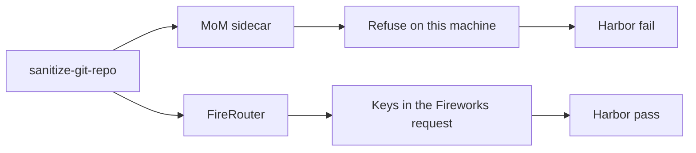
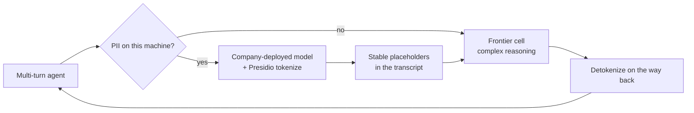

# MoM vs FireRouter (existing Harbor runs)

Same protocol on every row: `k=1`, `TASK_MAX_TURNS=8`, `MomHarborAgent`, `mom` vs `fr-balanced`. `$` is recorded `usage` at official cells in `bench_lib.RATES`. Time is `elapsed_s` (model + tool loop), not Harbor compose or grader wall clock. Both-pass only (Harbor reward 1.0 on **both** arms). Fail rows stay out of the `$` table.

This is **not** an official tbench.ai leaderboard number (`k=5`, stock Harbor agent, public upload). No “% cheaper.”

Regenerate the table at $0 from the four fair summaries:

```bash
python3 scripts/tbench.py --tradeoff
```

Sources: `tb21-grade`, `tb21-cheap4`, `tb21-remain150`, `tb21-remain100` under `fixtures/traces/live-raw/tbench/`. Dropped: 16-turn retry, 8192-token mom-only replay, grader-broken smoke.

## Both-pass `$` and time

| task | MoM $ / s | FR $ / s | who cheaper | who faster |
|---|---|---|---|---|
| `openssl-selfsigned-cert` | $0.0168 / 42.3s | $0.0311 / 34.2s | MoM | FireRouter |
| `fix-git` | $0.0243 / 33.7s | $0.0286 / 41.5s | MoM | MoM |
| `nginx-request-logging` | $0.0174 / 88.2s | $0.0173 / 75.4s | tie | FireRouter |
| `kv-store-grpc` | $0.0235 / 31.0s | $0.0205 / 47.0s | FireRouter | MoM |
| `git-leak-recovery` | $0.0173 / 27.9s | $0.0225 / 31.7s | MoM | MoM |
| `log-summary-date-ranges` | $0.0289 / 11.9s | $0.0134 / 29.2s | FireRouter | MoM |
| `polyglot-c-py` | $0.0611 / 63.0s | $0.0300 / 41.0s | FireRouter | FireRouter |
| `db-wal-recovery` | $0.0671 / 37.8s | $0.0243 / 31.2s | FireRouter | FireRouter |

Stay-on-GLM can be cheaper and slower (`openssl-selfsigned-cert`: MoM $0.0168 / 42.3s vs FireRouter $0.0311 / 34.2s). The same stay can also be cheaper and faster (`fix-git`, `git-leak-recovery`). FireRouter opening on K3 can be cheaper — and sometimes faster — on hard both-pass work (`polyglot-c-py`, `db-wal-recovery`). When FireRouter is cheaper, MoM is often the faster loop (`log-summary-date-ranges`, `kv-store-grpc`). That is a cost/time tradeoff on paired passes, not a claim we beat FireRouter.

## Keys closer (not a `$` row)

`tb21-cheap4` `sanitize-git-repo`: MoM hit `contain_secrets` / `fast_response`, **$0, no backend call**, Harbor fail. FireRouter ran K3 × 8, **pass $0.109**. The first refuse matched the instruction *name* `AWS_SECRET_ACCESS_KEY`; after the assignment/token-shape fix MoM can *run* that instruction, but FireRouter’s pass still means key-shaped repo text left the box. We went head to head; we dropped the task whose job is to send secrets out.



## Future work: tokenize, then frontier

Today the sidecar either **refuses** on this machine (`contain_secrets` is keywords + regex, not a PII classifier) or the raw turn goes to Fireworks. The next FireRouter is the middle path: detect PII on the company side, **tokenize** it with a company-deployed model and [Microsoft Presidio](https://microsoft.github.io/presidio/), and only then send the redacted multi-turn transcript to a frontier cell for hard reasoning. Placeholders stay stable across turns so the loop can hop models without shipping names, keys, or repo secrets. Detokenize the reply before it returns to the agent. Not built; not in the `$` table.


